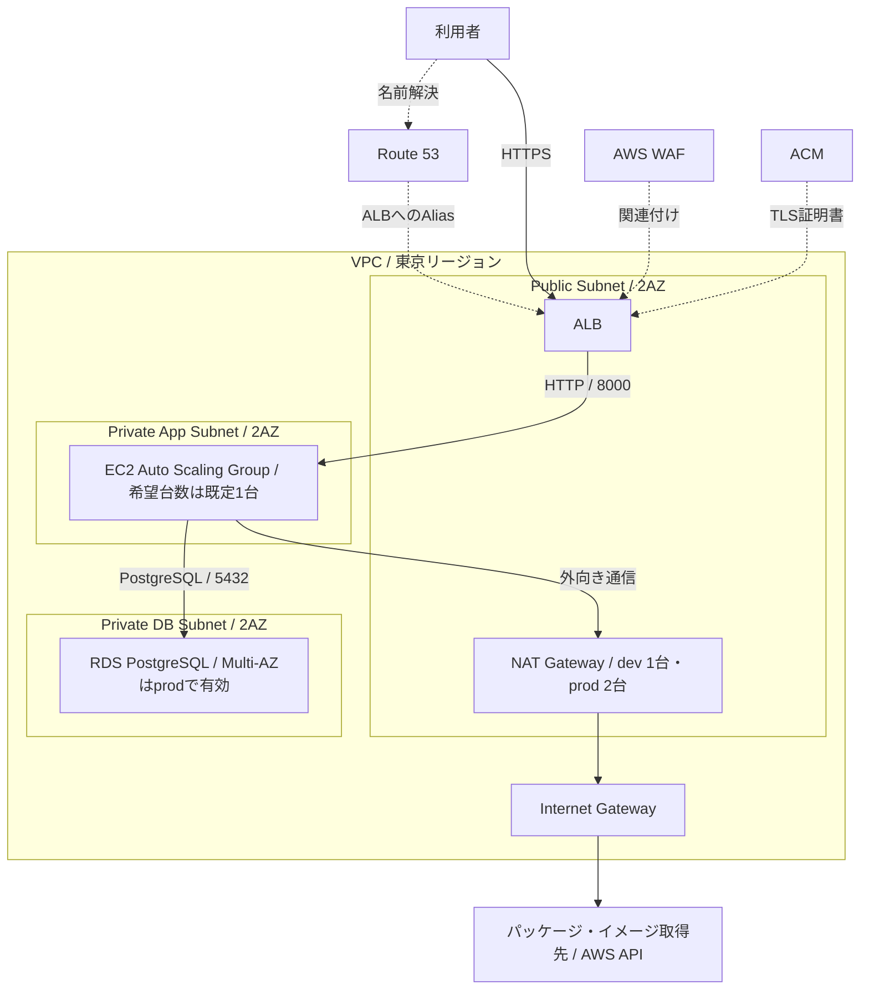

## はじめに

社内向け申請管理システムを題材に、AWS上でWeb APIの実行基盤「Dev-Portfolio」を構築しました。FastAPIをDockerで動かし、ALB、EC2 Auto Scaling Group、RDS for PostgreSQLを組み合わせています。

制作では、要件定義書と基本設計書を作成し、まずAWSのGUIでインフラを構築してから、TerraformでIaC化しました。この記事では、その構成をどのような単位でコードに分け、環境差分やリソース間の接続をどう表現したかを紹介します。

:::message
この記事で扱うのは、リポジトリのTerraform定義とその既定値です。実環境へ適用した値や稼働状況を示すものではありません。

可用性を考慮して2AZにサブネットを配置していますが、EC2の希望台数はdev／prodともに既定で1台です。常時2台のアプリケーションサーバーが稼働する構成や、無停止を検証済みのシステムではありません。可用性の範囲と残る課題も後半で説明します。
:::

## 構築したシステムと要件

アプリケーションには、一般ユーザーが申請を作成し、管理者が承認・却下する機能を実装しています。インフラについては、`docs/requirements.md`で次の方針を定めています。

| 観点 | 要件・方針 |
| --- | --- |
| 通信経路 | インターネットからの入口をALBに限定し、EC2とRDSを直接公開しない |
| 可用性 | 複数AZにまたがる構成とし、ALBとASGを利用する。prodではRDS Multi-AZを有効にする |
| 運用接続 | EC2へのSSH接続は行わず、Systems Managerを利用する |
| 機密情報 | DB認証情報とアプリケーションのSecretをSecrets Managerで管理する |
| 運用 | インフラをTerraformで管理し、ログ収集・監視通知も構成に含める |
| コスト | devは検証コストを抑え、prodは本番を想定した可用性と保護を重視する |

学習はITの基礎からPythonへ進み、プログラムを動かす基盤としてクラウドに関心を持ったことが、AWSに取り組むきっかけです。また、実行基盤にはEC2＋Dockerを選びました。ECSで抽象化する前に基盤を理解することと、Dockerでポータビリティを持たせることを意図しています。

## AWSアーキテクチャ

東京リージョンの`ap-northeast-1a`と`ap-northeast-1c`に、Public、Private App、Private DBの3種類のサブネットをそれぞれ配置します。

以下は通信と配置の関係を示す簡略図です。ASGの枠は配置先が2AZにまたがることを示しており、各AZにEC2が1台ずつ常時稼働する意味ではありません。



Route 53は名前解決を担い、HTTPリクエストは利用者からALBへ届きます。ALBの80番ポートはHTTPSへリダイレクトし、443番ポートでTLSを終端します。ALBからEC2への転送はHTTPです。

Route 53の公開ホストゾーンは`data "aws_route53_zone"`で既存のものを参照しています。Terraformで作成するのは、アプリケーション用のAliasレコードやACMのDNS検証レコードなどです。

サブネットの役割はルートテーブルでも分けています。

| サブネット | 配置するリソース | インターネット向けデフォルトルート |
| --- | --- | --- |
| Public | ALB、NAT Gateway | Internet Gateway |
| Private App | EC2 Auto Scaling Group | NAT Gateway |
| Private DB | RDS PostgreSQL | なし |

EC2では起動時にパッケージやDockerイメージを取得し、AWS APIにもアクセスします。現在のコードにはVPC Endpointの定義がなく、Private Appからの外向き通信はNAT Gatewayを経由する構成です。

## Terraformを採用した理由

Terraformを採用した理由は、インフラ基盤を属人化させないためです。構築した人だけが設定内容を把握している状態を避け、構成をコードとして残すことを重視しました。

また、CloudFormationではなくTerraformを選んだ背景には、マルチクラウドにも対応できるようにしたいという意図があります。ただし、このリポジトリで実装しているのはAWSのリソースです。他クラウドにそのまま適用できる共通コードを作ったわけではありません。

今回のIaC化では、サブネットの配置、Security Groupの参照関係、環境ごとの可用性設定までTerraformに記述しています。たとえば「prodのDBはMulti-AZにする」という方針を、環境側の変数からDB moduleへ渡す形です。

## Terraformのディレクトリ構成

主要な構成は次のとおりです。各ディレクトリ内のファイルは一部省略しています。

```text
infra/
├── bootstrap/             # 環境のstateを保存するS3バケット
├── envs/
│   ├── dev/               # dev用のroot module
│   └── prod/              # prod用のroot module
├── modules/
│   ├── network/           # VPC、Subnet、ルート、NAT、Security Group
│   ├── app/               # ALB、ACM、DNSレコード、Launch Template、ASG
│   ├── db/                # DB Subnet Group、RDS
│   ├── security/          # IAM、KMS、Secrets Manager、WAF
│   ├── operations/        # ログ保存先、SNS、Slack通知連携
│   └── monitoring/        # CloudWatch Alarm
├── .terraform-version
└── README.md
```

`envs`で環境ごとの値を受け取り、共通の`modules`を組み合わせています。`dev/main.tf`と`prod/main.tf`のmodule呼び出しは同じで、主な差分は`variables.tf`の既定値と`backend.tf`のstate保存先キーです。

`variables.tf`はmoduleへの入力、`outputs.tf`は作成したリソースのIDやARNなどの受け渡しを定義します。`locals.tf`では環境名とプロジェクト名から名前の接頭辞を作り、Providerの`default_tags`で`Project`、`Env`、`ManagedBy`を設定しています。

リポジトリの`.terraform-version`はTerraform `1.15.5`です。環境側の`versions.tf`ではAWS Providerを`>= 5.61.0, < 6.0.0`に制約し、dev／prodのロックファイルでは`5.100.0`を選択しています。

### bootstrapでstateの保存先を分ける

`bootstrap`では、環境のstateを保存するS3バケットを作成します。バージョニング、パブリックアクセスのブロック、SSE-S3による暗号化を設定しています。

dev／prodは同じバケットを参照し、キーをそれぞれ`envs/dev/terraform.tfstate`と`envs/prod/terraform.tfstate`に分けています。環境ディレクトリごとにS3 Backendを持つ構成で、Terraform workspaceによる切り替えではありません。

`infra/envs/dev/backend.tf`の抜粋です。バケット名などは掲載を省略しています。

```hcl
terraform {
  backend "s3" {
    # 省略
    encrypt      = true
    use_lockfile = true
  }
}
```

`use_lockfile`でS3 Backendのstate lockを有効にしています。DynamoDBのロックテーブルは定義していません。この設定の仕様は[HashiCorpのS3 Backendドキュメント](https://developer.hashicorp.com/terraform/language/backend/s3)で確認できます。

なお、`bootstrap`自体にはBackendの指定がありません。環境側のstateと、保存先バケットを作成するbootstrap側のstateは、管理対象を分けて扱う必要があります。

## dev／prodで変えていること

要件定義では、devは低コストで検証しやすく、prodは本番を想定した可用性と保護を重視する方針です。現在の`infra/envs/{dev,prod}/variables.tf`にある既定値は次のとおりです。

| 設定 | dev | prod |
| --- | --- | --- |
| NAT Gateway数 | 1 | 2 |
| RDS Multi-AZ | 無効 | 有効 |
| RDS自動バックアップ保持 | 0日 | 7日 |
| RDS削除保護 | 無効 | 有効 |
| `skip_final_snapshot` | `true` | `false` |
| アプリ用Secretの削除復旧期間 | 0日 | 30日 |
| KMSキー削除の待機期間 | 7日 | 30日 |
| ALBログ用S3の`force_destroy` | `true` | `false` |

一方、EC2はどちらも`t3.micro`、RDSは`db.t4g.micro`です。ASGも両環境で最小1台・最大2台・希望1台となっています。prodという名前だけで、EC2台数やインスタンスサイズを増やしているわけではありません。

ログ保持期間も環境差分にはしていません。CloudWatch Logsはcloud-init関連とSSM Agentログが7日、DockerアプリケーションログとWAFログが30日です。ALBアクセスログのS3には30日で削除するルールを設定しています。

また、prodの`skip_final_snapshot = false`に対して、現在のDB moduleには`final_snapshot_identifier`の指定がありません。最終スナップショットを伴う削除にはこの指定が必要なため、削除手順まで完成した構成とは扱っていません。[AWS Provider 5.100.0の定義](https://github.com/hashicorp/terraform-provider-aws/blob/v5.100.0/website/docs/r/db_instance.html.markdown)も確認し、削除時の設定を補う必要があります。

## 主要moduleをどう接続したか

### network：NATの台数とルートを一緒に切り替える

NAT Gatewayを1台にする場合と2台にする場合では、作成数だけでなく、Private App Subnetの接続先も変わります。

`infra/modules/network/network.tf`では、次のようにルートを定義しています。

```hcl
resource "aws_route" "private_app_default" {
  count = length(aws_route_table.private_app)

  route_table_id         = aws_route_table.private_app[count.index].id
  destination_cidr_block = "0.0.0.0/0"
  # Reuse the last NAT gateway when fewer NATs than app subnets are requested.
  nat_gateway_id = aws_nat_gateway.main[min(count.index, var.nat_gateway_count - 1)].id
}
```

現在の2AZ構成では、devの両サブネットは同じNAT Gatewayを参照します。prodはサブネットとNAT Gatewayの配列順が対応し、それぞれ同一AZのNAT Gatewayを参照します。

devではNAT Gatewayを1台に抑える代わりに、両AZのアプリケーションの外向き通信が、その1台に依存します。サブネットを2AZに作るだけでは、外向き通信まで冗長になるわけではありません。

### module間はoutputを通して接続する

`network`で作成したPrivate DB SubnetとSecurity Groupを、環境側の`main.tf`で`db`へ渡します。`infra/envs/dev/main.tf`から必要な部分を抜粋します。

```hcl
module "db" {
  source = "../../modules/db"

  name_prefix           = local.name_prefix
  private_db_subnet_ids = module.network.private_db_subnet_ids
  db_security_group_id  = module.network.db_security_group_id

  # 省略
  db_multi_az          = var.db_multi_az

  backup_retention_period = var.backup_retention_period
  deletion_protection     = var.deletion_protection
  skip_final_snapshot     = var.skip_final_snapshot

  kms_key_arn = module.security.kms_key_arn
}
```

リソースIDを手で転記せず、`module.network`や`module.security`のoutputを参照しています。環境側で「どのネットワークに、どの暗号鍵と可用性設定でDBを作るか」が読み取れます。

同様に、DBの接続先や管理対象SecretのARNは`app`へ渡し、EC2の起動設定に利用します。`operations`はログ保存先と通知先を作り、`monitoring`はアプリケーションやDBの識別子、通知先ARNを受け取ってAlarmを定義しています。

### app：EC2を起動する手順もコードに含める

`app`ではALBだけでなく、Launch TemplateとASGも定義しています。Launch Templateのuser dataは、`user_data.sh.tftpl`へ変数を渡して生成します。

起動時には、DockerやCloudWatch Agentなどを準備し、Secrets Managerから認証情報を取得して環境変数ファイルを生成します。その後、Dockerイメージを取得し、Alembicのマイグレーションとアプリケーション起動を実行します。

ASGの定義から、配置とヘルスチェックに関係する部分を抜粋します。

```hcl
resource "aws_autoscaling_group" "app" {
  name                = "${local.name_prefix}-asg-app"
  min_size            = var.asg_min_size
  max_size            = var.asg_max_size
  desired_capacity    = var.asg_desired_capacity
  vpc_zone_identifier = var.private_app_subnet_ids
  target_group_arns   = [aws_lb_target_group.app.arn]
  health_check_type   = "ELB"

  launch_template {
    id      = aws_launch_template.app.id
    version = aws_launch_template.app.latest_version
  }

  # 省略
}
```

出典は`infra/modules/app/app.tf`です。ALBのTarget GroupをASGに関連付け、ELBのヘルスチェックを利用しています。異常と判定されたインスタンスをASGが置き換える仕組みについては、[AWSのヘルスチェックの説明](https://docs.aws.amazon.com/autoscaling/ec2/userguide/health-checks-overview.html)に沿った設定です。

ただし、リソースの作成とアプリケーションの起動成功は別に確認する必要があります。今回の起動処理は外部からのパッケージ・イメージ取得やDB接続を伴うため、Terraformの定義だけでなく、起動ログとTarget Groupの状態も確認対象になります。

## セキュリティをコードで表現する

### Security Groupは通信元の役割で制限する

EC2のSecurity GroupはALBのSecurity Groupからのアプリケーションポートだけを受け付けます。RDS側も同様に、EC2のSecurity Groupを通信元に指定しています。

`infra/modules/network/security_group.tf`のDB側の抜粋です。

```hcl
resource "aws_security_group" "db" {
  # 省略
  ingress {
    description     = "Allow PostgreSQL from app servers"
    from_port       = 5432
    to_port         = 5432
    protocol        = "tcp"
    security_groups = [aws_security_group.app.id]
  }
  # 省略
}
```

特定のEC2のIPアドレスではなくSecurity Groupを参照するため、ASGでインスタンスが入れ替わる構成にも対応できます。EC2の22番ポートを許可するルールはありません。EC2のIAM Roleには`AmazonSSMManagedInstanceCore`を付与しています。

一方、Security Groupのアウトバウンドは全許可です。入口とレイヤー間の受信を制限していますが、送信先まで最小限に絞った構成ではありません。

### DBの非公開化と認証情報管理を分けて設定する

`infra/modules/db/db.tf`では、Private DB Subnetへの配置に加え、公開アクセスを無効にし、ストレージを暗号化しています。

```hcl
resource "aws_db_instance" "main" {
  # 省略
  storage_type          = "gp3"
  storage_encrypted     = true
  kms_key_id            = var.kms_key_arn

  # 省略
  manage_master_user_password = true

  db_subnet_group_name   = aws_db_subnet_group.main.name
  vpc_security_group_ids = [var.db_security_group_id]

  multi_az            = var.db_multi_az
  publicly_accessible = false

  # 省略
}
```

DBのマスターパスワードはRDSによるSecrets Manager管理を有効にしています。EC2にはそのSecretを読む権限を与え、起動時に取得します。アプリケーション側のSecretは別途`security`で生成・保存しています。

ここで、Secrets Managerを使うことと、Terraformのstateに機密値が残らないことは別です。現在のアプリ用Secretは`random_password`と`aws_secretsmanager_secret_version`で管理しており、stateも機密情報として保護する必要があります。`sensitive`の指定もstateへの保存を防ぐものではありません。[HashiCorpの機密データ管理の説明](https://developer.hashicorp.com/terraform/language/manage-sensitive-data)で、この違いを確認できます。

また、取得後の認証情報はEC2上の`.env.ec2`に書き出しています。Secrets Managerへの保存だけで完結せず、取得後のファイルやログの扱いも管理対象になります。

### 実装済みの対策と残る範囲

WAFはALBに関連付け、Common Rule SetとSQLi Rule Setを設定しています。SQLi側には特定の認証リクエストに対する検査対象の絞り込みがあります。例外の背景と検証は、別の記事で扱います。

暗号化は区間によって異なります。利用者からALBまではHTTPS、ALBからEC2まではHTTPです。EC2からPostgreSQLへの接続文字列には`sslmode=require`を指定しています。

IAMについても、すべてを最小権限化できているわけではありません。Terraform実行用Roleに付与するポリシーの既定値は、dev／prodともに`AdministratorAccess`です。DB接続にはマスターユーザーを利用しており、アプリケーション用DBユーザーの権限分離も改善点です。

## 可用性・運用で区別したいこと

### 2AZへの配置と、常時冗長化は異なる

現在の定義では、ALBとASGの配置先に2AZのサブネットを指定し、prodのRDSではMulti-AZを有効にしています。

ただし、ASGの希望台数は既定で1台です。インスタンスが異常になった場合に置き換える仕組みがあっても、代替インスタンスが起動してアプリケーションを受け付けるまで、サービスが利用できない時間は生じ得ます。

さらに、ASGにはRollingのinstance refreshを設定していますが、その設定だけで無停止の更新を保証するものではありません。常時複数台での稼働や更新中のサービス継続は、台数設定と起動処理を含めて検証する必要があります。

### ASGがあることと、負荷で台数が増えることも異なる

現在のコードには、CPU使用率などに連動して台数を増減するScaling Policyを定義していません。最大台数が2台でも、負荷が高くなれば自動で2台になる設定ではありません。CPUのAlarmは通知用です。

また、ALBのヘルスチェック先は`/api/v1/health`ですが、このAPIは`{"status": "ok"}`を返す実装で、DBへの接続確認は行いません。アプリケーションの応答確認と、DBを含む業務処理の正常性確認は分けて考える必要があります。

### 起動後のログと監視まで含める

`operations`ではCloudWatch Logsのロググループ、ALBアクセスログ用S3、SNSとSlack通知連携を定義しています。`monitoring`ではASG、ALB、Target Group、RDSを対象とするAlarmを定義しています。

構成の静的なチェックとして、CIには`terraform fmt -check`と、dev／prodそれぞれの`terraform validate`を組み込んでいます。ただし、これらはアプリケーションの動作や障害時の復旧を確認する試験ではありません。

CI/CDの認証・デプロイ手順と、重要度別の監視通知設計は、それぞれ別の記事で詳しく扱う予定です。

## GUI構築からIaC化して整理したこと

今回の構成をコードで整理すると、個々のサービス名だけでなく、次の3つの関係が見えるようになります。

1. **通信の許可と到達経路**：Private Subnetへの配置、ルートテーブル、Security Groupは、それぞれ別の設定です。EC2はNAT経由で外部へ通信し、DBにはインターネット向けデフォルトルートを持たせていません。
2. **共通構成と環境方針**：同じDB moduleでも、Multi-AZやバックアップ保持を環境側の値として渡すことで、dev／prodの方針を表現しています。
3. **リソースと起動処理**：EC2を作成するだけでなく、認証情報の取得、DBマイグレーション、コンテナの起動までつなげて、アプリケーションの実行基盤になります。

同時に、コードにしたことで、まだ実装していない範囲も具体的に示せます。たとえば、負荷連動の自動スケール、常時複数台でのサービス継続、IAMの最小権限化は、現状の構成と分けて扱うべき課題です。

## まとめ

Dev-Portfolioでは、AWS上のWeb API基盤を`bootstrap`、`envs`、`modules`に分けてTerraformで管理しています。ネットワークやSecurity Groupの参照関係をコード化し、NAT Gateway数、RDS Multi-AZ、バックアップや削除保護の違いを環境ごとの既定値にまとめました。

この構成は、複数AZへの配置とインスタンスの置き換えを取り入れた基盤です。その一方で、EC2の既定台数は1台であり、可用性を高める設定と実際にサービスが継続できることは、別に確認する必要があります。

インフラを属人化させないためにも、作成するリソースに加えて、環境ごとの違いと運用上の限界までコードと説明を対応させて残していきます。
